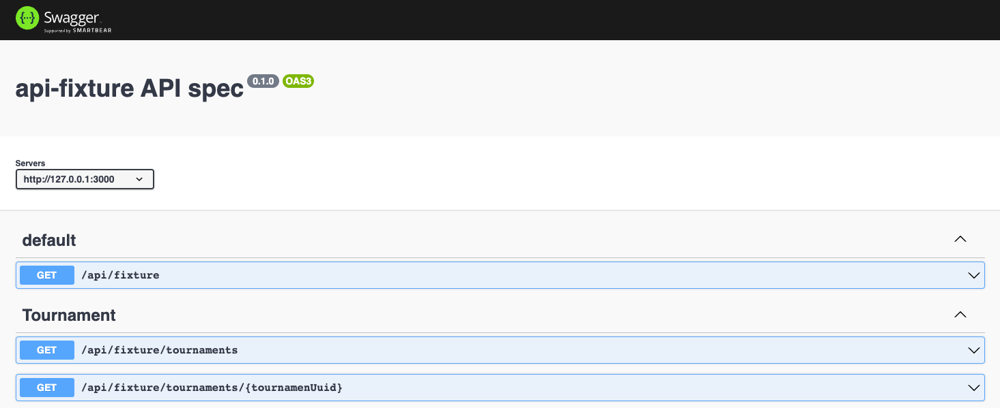
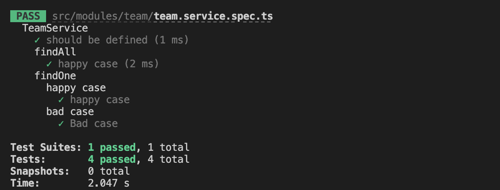

# Demo be app

![Context]
You have been tasked to build APIs to support our frontend (web & mobile) teams for the sections circled (in red) in the image above.
These sections are known as the Fixtures module, and we will need APIs to support Fixtures Listing and Fixtures Calendar to display
only dates with matches.

**🚨🚨🚨 Please note: This is not a production-ready application**
## Getting Started

**Technical Stack**

    - NestJs / TypeORM
    - MySQL
    - Jest
    - Additional: Husky / Pretty
### Prerequisites

What things you need to install

    Node.js v14.20
    yarn
    docker-compose (optional)

### Installing
#### With Docker

    1. Clone the repository
    2. Build docker: `docker-compose build`
    3. Run docker image: `docker-compose up -d`

#### Without Docker

    1. Clone the repository
    2. Install MySQL
        - Database: api_fixture
        - Username: assignment_db
        - Password: Abcd1234
        Credential above is default.
        You can revise it in config directory (config/default.yaml)
    3. Install dependencies: `yarn`
    4. Start service at port 3007: `yarn start:dev`

## Usage
- Main site: http://localhost:3000
- Swagger url: http://localhost:3000/docs/fixtures
You can also use my temporary site at fixtures.jobfi.vn
(Please ignore the domain name)

## Running the tests

### Backend
    - Run yarn `test:cov`
    - Testing Coverage: > 80%
### SSE Testing
    - Open sse_testing.html
    - When server update a fixture, a message will be sent to client
## Screenshots

## Flow

## What next
- Master/Slave database
- Add caching
- Optimize Docker build
- Improve logging
- etc..
